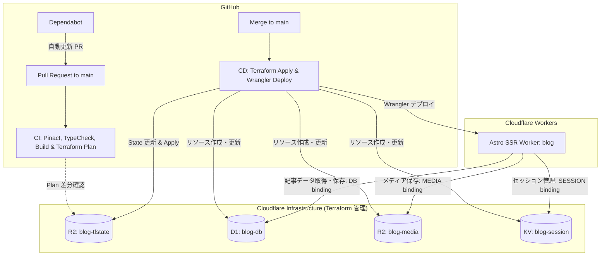

# Cloudflare デプロイ & CI/CD 運用ガイド

本ドキュメントは、EmDash ブログサイトのインフラ管理（Terraform）および CI/CD パイプライン（GitHub Actions）の初期セットアップと日常の運用手順について説明します。

---

## 1. 全体アーキテクチャ概要

本システムは、Astro + EmDash CMS を Cloudflare Workers 上で SSR（Server-Side Rendering）動作させ、インフラリソース（D1 / R2 / KV）を Terraform でコード管理（IaC）しています。



### リソース一覧とバインディング

| リソース種別 | リソース名 | バインディング名 (`wrangler.jsonc`) | 用途 |
| :--- | :--- | :--- | :--- |
| **D1 Database** | `blog-db` | `DB` | 記事データ・メタデータ保存 |
| **R2 Bucket** | `blog-media` | `MEDIA` | 画像・メディアアセット保存 |
| **KV Namespace** | `blog-session` | `SESSION` | 管理画面セッション保持 |
| **R2 Bucket (tfstate)** | `blog-tfstate` | - | Terraform 状態管理 (S3 backend) |

---

## 2. 初期セットアップ手順（事前準備）

本番運用を開始する前に、Cloudflare ダッシュボードで以下の初期リソースと認証情報を準備します。

### 2.1 Cloudflare アカウント ID の確認
1. [Cloudflare ダッシュボード](https://dash.cloudflare.com/)にログインします。
2. 画面右上の URL または Workers/Pages などのメニューから **Account ID**（32文字の英数字）を確認し、メモします。

### 2.2 Terraform リモートステート用 R2 バケットの作成
Terraform の実行状態（`terraform.tfstate`）を安全にリモート共有するため、R2 バケットを手動で 1 つ作成します。

1. Cloudflare ダッシュボードの左メニューから **R2 Storage** を選択します。
2. **Create bucket** をクリックします。
3. バケット名に **`blog-tfstate`** を入力し、作成します（ロケーションは任意、APAC または Automatic 推奨）。

### 2.3 R2 用 S3 互換 API 認証情報の発行
Terraform の S3 バックエンドが R2 にアクセスするために必要なアクセスキーを発行します。

1. **R2 Storage** の画面右上にある **Manage R2 API Tokens** をクリックします。
2. **Create API token** をクリックします。
3. 以下の設定を行い、トークンを作成します:
   - **Token name**: `terraform-r2-tfstate-token`
   - **Permissions**: **Admin Read & Write**（または特定バケット `blog-tfstate` に対する Read & Write）
   - **TTL**: 必要に応じて設定（運用中は無期限推奨）
4. 作成後に表示される以下の値をメモします（**※作成直後のみ表示されます**）:
   - **Access Key ID** (`AWS_ACCESS_KEY_ID` として使用)
   - **Secret Access Key** (`AWS_SECRET_ACCESS_KEY` として使用)

### 2.4 Cloudflare API トークンの発行
Terraform によるリソース作成および Wrangler による Workers デプロイに必要な API トークンを発行します。

1. 右上のユーザーアイコン > **My Profile** > **API Tokens** を開きます。
2. **Create Token** をクリックします。
3. **Custom Token (Get started)** を選択し、以下の権限を設定します:
   - **Token name**: `github-actions-blog-deploy`
   - **Permissions**:
     - `Account` - `Workers D1 Storage` - `Edit`
     - `Account` - `Workers R2 Storage` - `Edit`
     - `Account` - `Workers KV Storage` - `Edit`
     - `Account` - `Workers Scripts` - `Edit`
     - `Account` - `Account Settings` - `Read`
   - **Account Resources**:
     - `Include` - `All accounts` (または対象のアカウントを選択)
4. **Continue to summary** > **Create Token** をクリックし、生成された **API Token**（`CLOUDFLARE_API_TOKEN` として使用）をメモします。

---

## 3. GitHub Secrets の登録

GitHub リポジトリの **Settings** > **Secrets and variables** > **Actions** に進み、**New repository secret** より以下の 4 つの環境変数を登録します。

| Secret 名 | 設定する値 | 用途 |
| :--- | :--- | :--- |
| `CLOUDFLARE_API_TOKEN` | 2.4 で発行した Cloudflare API トークン | Terraform Provider および Wrangler デプロイ認証 |
| `CLOUDFLARE_ACCOUNT_ID` | 2.1 で確認した Cloudflare アカウント ID | Terraform リソース作成および Workers デプロイ先指定 |
| `AWS_ACCESS_KEY_ID` | 2.3 で発行した R2 API の Access Key ID | Terraform S3 backend (R2) 認証 |
| `AWS_SECRET_ACCESS_KEY` | 2.3 で発行した R2 API の Secret Access Key | Terraform S3 backend (R2) 認証 |

---

## 4. 初回デプロイと `wrangler.jsonc` の ID 更新

Terraform で作成されたリソースの ID を `wrangler.jsonc` に反映する手順です。

### 4.1 初回インフラ作成 (Terraform)
ローカルから実行するか、`main` ブランチにプッシュして GitHub Actions の `deploy.yml` を初回実行します。

ローカルで実行する場合:
```bash
cd terraform
export CLOUDFLARE_API_TOKEN="<your-api-token>"
export CLOUDFLARE_ACCOUNT_ID="<your-account-id>"
export AWS_ACCESS_KEY_ID="<your-r2-access-key-id>"
export AWS_SECRET_ACCESS_KEY="<your-r2-secret-access-key>"

terraform init -backend-config="endpoint=https://${CLOUDFLARE_ACCOUNT_ID}.r2.cloudflarestorage.com"
terraform apply -var="cloudflare_account_id=${CLOUDFLARE_ACCOUNT_ID}"
```

### 4.2 出力された ID を `wrangler.jsonc` に反映
Terraform 適用後、以下のコマンドで生成された D1 データベース ID および KV ネームスペース ID を確認します:

```bash
cd terraform
terraform output
```

出力例:
```hcl
d1_database_id = "xxxxxxxx-xxxx-xxxx-xxxx-xxxxxxxxxxxx"
kv_namespace_id = "yyyyyyyyyyyyyyyyyyyyyyyyyyyyyyyy"
r2_bucket_name = "blog-media"
```

プロジェクトルートの [`wrangler.jsonc`](file:///Users/rikiyaota/Documents/github.com/RikiyaOta/blog/wrangler.jsonc) のプレースホルダー部分を実際の ID に書き換えてコミットします:

```jsonc
{
  "$schema": "node_modules/wrangler/config-schema.json",
  "name": "blog",
  "compatibility_date": "2026-02-24",
  "compatibility_flags": ["nodejs_compat"],
  "assets": {
    "directory": "./dist"
  },
  "d1_databases": [
    {
      "binding": "DB",
      "database_name": "blog-db",
      "database_id": "xxxxxxxx-xxxx-xxxx-xxxx-xxxxxxxxxxxx"
    }
  ],
  "r2_buckets": [
    {
      "binding": "MEDIA",
      "bucket_name": "blog-media"
    }
  ],
  "kv_namespaces": [
    {
      "binding": "SESSION",
      "id": "yyyyyyyyyyyyyyyyyyyyyyyyyyyyyyyy"
    }
  ]
}
```

---

## 5. CI/CD パイプラインの仕組み

### 5.1 プルリクエスト検証 (`.github/workflows/ci.yml`)
`main` ブランチに対するすべての Pull Request で自動実行されます。

- **GitHub Actions コミットハッシュ固定の検証**: `pinact run --verify` でサードパーティ製アクションのハッシュピン留めを検証。
- **依存関係インストール**: `pnpm install --frozen-lockfile`
- **TypeScript 型検査**: `pnpm exec tsc --noEmit`
- **Cloudflare SSR 本番ビルドテスト**: `CLOUDFLARE=true pnpm build`
- **Terraform コードフォーマット検査**: `terraform fmt -check`
- **Terraform 差分計画 (Dry-run)**: `terraform init` & `terraform plan`

### 5.2 本番自動デプロイ (`.github/workflows/deploy.yml`)
`main` ブランチへのコミットマージ時に自動実行されます（同時デプロイ防止のための `concurrency` 制御付き）。

1. **インフラ自動適用**: `terraform init` & `terraform apply -auto-approve`
2. **本番 Astro ビルド**: `CLOUDFLARE=true pnpm build`
3. **Cloudflare Workers へデプロイ**: `pnpm exec wrangler deploy`

### 5.3 サプライチェーンセキュリティ & Dependabot
- [`.github/dependabot.yml`](file:///Users/rikiyaota/Documents/github.com/RikiyaOta/blog/.github/dependabot.yml) により、GitHub Actions のバージョン更新が週次でチェックされ、自動でピン留めコミットハッシュ付きの PR が生成されます。

---

## 6. ローカル開発・検証コマンド一覧 (`mise` 準拠)

本プロジェクトでは [`mise.toml`](file:///Users/rikiyaota/Documents/github.com/RikiyaOta/blog/mise.toml) を使用して Node.js, pnpm, Terraform, pinact のバージョンを統一管理しています。

### 6.1 環境セットアップ
```bash
# ツールチェーンのインストール
mise install

# 依存パッケージのインストール
mise exec -- pnpm install
```

### 6.2 開発サーバー起動とシードデータ投入
```bash
# ローカル開発サーバー起動 (Node.js + SQLite / local uploads モード)
mise exec -- pnpm dev

# 初期シードデータ (サンプル記事・タグ・サイト設定) の投入
mise exec -- pnpm run db:seed
```

### 6.3 検証コマンド
```bash
# TypeScript 型定義の再生成
mise exec -- pnpm run types

# 型チェック
mise exec -- pnpm exec tsc --noEmit

# ローカルビルドテスト (Node.js standalone アダプター)
mise exec -- pnpm build

# Cloudflare SSR ビルドテスト (@astrojs/cloudflare アダプター)
mise exec -- env CLOUDFLARE=true pnpm build

# Terraform フォーマットチェック
cd terraform && mise exec -- terraform fmt -check && cd ..

# GitHub Actions ピン留め検証
mise exec -- pinact run --verify

# GitHub Actions ピン留め自動更新 (ワークフロー編集後など)
mise exec -- pinact run
```

---

## 7. トラブルシューティング

### Q1. Terraform Plan / Apply で S3 バックエンド接続エラーが発生する
- **原因**: `AWS_ACCESS_KEY_ID`, `AWS_SECRET_ACCESS_KEY`, `CLOUDFLARE_ACCOUNT_ID` の不一致、または R2 バケット `blog-tfstate` が未作成である可能性があります。
- **対処**:
  1. Cloudflare ダッシュボードで `blog-tfstate` バケットが存在するか確認。
  2. R2 API トークンを再生成し、GitHub Secrets を更新してください。

### Q2. CI の `pinact run --verify` が失敗する
- **原因**: `.github/workflows/` 内のアクション参照（`uses:`）に Git コミットハッシュ（40桁 SHA）ではなくタグ名（`@v4` など）が直接書かれています。
- **対処**:
  ローカルで `mise exec -- pinact run` を実行してコミットハッシュに自動置換した上でコミットしてください。

### Q3. Wrangler デプロイ時にバインディングエラーが出る
- **原因**: `wrangler.jsonc` の `database_id` または `id` がプレースホルダーのままになっているか、Cloudflare 側に該当リソースが存在していません。
- **対処**:
  Terraform apply が正常完了していることを確認し、`terraform output` の値を `wrangler.jsonc` に反映してください。
