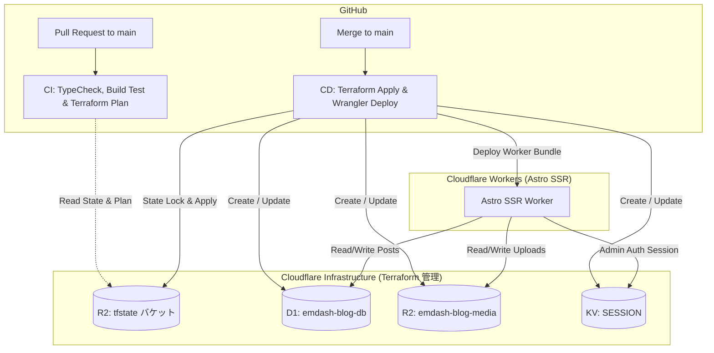

# Cloudflare CI/CD & Terraform インフラ設計仕様書

## 1. 概要
本仕様書は、EmDash ブログサイト（Cloudflare SSR 構成）の本番インフラを **Terraform** でコード管理（IaC）し、**GitHub Actions** を通じて PR 時の検証（`terraform plan` & ビルドテスト）および `main` ブランチマージ時の自動デプロイ（`terraform apply` & `wrangler deploy`）を実現するための構成と運用手順を定めます。

---

## 2. アーキテクチャと責務分離



### 責務の分離方針
1. **Terraform**: Cloudflare 上のストレージインフラ（D1 データベース、R2 メディアバケット、KV ネームスペース）の作成と設定管理を担当。
2. **GitHub Actions / Wrangler**: Terraform がプロビジョニングしたインフラを参照し、Astro アプリケーションを SSR ビルドして Cloudflare Workers へデプロイ。

---

## 3. Terraform 設計

### 3.1 ディレクトリ構成
```
terraform/
├── main.tf        # Provider 設定, S3 バックエンド (R2), D1 / R2 / KV リソース
├── variables.tf   # 変数定義 (account_id, environment 等)
└── outputs.tf     # 出力定義 (d1_id, r2_name, kv_id)
```

### 3.2 Terraform バックエンド (Cloudflare R2)
Terraform の状態管理ファイル (`terraform.tfstate`) は、Cloudflare R2 の S3 互換 API を利用してリモート管理します。

```hcl
terraform {
  required_version = ">= 1.5.0"
  required_providers {
    cloudflare = {
      source  = "cloudflare/cloudflare"
      version = "~> 4.52.0"
    }
  }

  backend "s3" {
    bucket                      = "terraform-state"
    key                         = "blog/terraform.tfstate"
    region                      = "auto"
    endpoint                    = "https://<CLOUDFLARE_ACCOUNT_ID>.r2.cloudflarestorage.com"
    skip_credentials_validation = true
    skip_region_validation      = true
    skip_requesting_account_id  = true
    skip_s3_checksum            = true
    skip_metadata_api_check     = true
  }
}
```

### 3.3 リソース定義
- **D1 データベース**: `cloudflare_d1_database`
  - 名前: `emdash-blog-db`
- **R2 メディアバケット**: `cloudflare_r2_bucket`
  - 名前: `emdash-blog-media`
- **KV ネームスペース**: `cloudflare_workers_kv_namespace`
  - タイトル: `SESSION`

---

## 4. ツール管理 (`mise.toml`)

ローカル開発環境および GitHub Actions CI/CD で完全同一のツールチェーンを保証するため、[`mise.toml`](file:///Users/rikiyaota/Documents/github.com/RikiyaOta/blog/mise.toml) に `terraform` を追加します。

```toml
[settings]
minimum_release_age = "7d"

[tools]
node = "26"
pnpm = "11"
terraform = "1"
```

---

## 5. GitHub Actions ワークフロー設計

### 5.1 PR 検証ワークフロー (`.github/workflows/ci.yml`)
- **トリガー**: `pull_request` (target: `main`)
- **ステップ**:
  1. `actions/checkout@v4`
  2. `jdx/mise-action@v2` (mise ツール自動インストール)
  3. `pnpm install --frozen-lockfile`
  4. `pnpm exec tsc --noEmit` (型チェック)
  5. `env CLOUDFLARE=true pnpm build` (本番 SSR ビルドテスト)
  6. `terraform init` (R2 backend 接続)
  7. `terraform plan` (インフラ変更差分の検証)

### 5.2 本番デプロイワークフロー (`.github/workflows/deploy.yml`)
- **トリガー**: `push` (branches: `[main]`)
- **ステップ**:
  1. `actions/checkout@v4`
  2. `jdx/mise-action@v2`
  3. `pnpm install --frozen-lockfile`
  4. `terraform init` & `terraform apply -auto-approve` (インフラ自動反映)
  5. `env CLOUDFLARE=true pnpm build` (本番 Astro ビルド)
  6. `pnpm exec wrangler deploy` (Cloudflare Workers 本番デプロイ)

---

## 6. 必要な GitHub Secrets

GitHub リポジトリの Settings > Secrets and variables > Actions に以下を設定します:

| シークレット名 | 用途 |
| :--- | :--- |
| `CLOUDFLARE_API_TOKEN` | Cloudflare Terraform Provider & Wrangler デプロイ用 API トークン |
| `CLOUDFLARE_ACCOUNT_ID` | Cloudflare アカウント ID |
| `AWS_ACCESS_KEY_ID` | R2 S3 互換 API 用 Access Key ID（tfstate バックエンド用） |
| `AWS_SECRET_ACCESS_KEY` | R2 S3 互換 API 用 Secret Access Key（tfstate バックエンド用） |

---

## 7. 初期セットアップ手順（事前準備）
1. Cloudflare ダッシュボードの R2 にて、tfstate 保存用のバケット（`terraform-state`）を事前に作成。
2. Cloudflare ダッシュボードの R2 > "Manage R2 API Tokens" で S3 互換 API トークン（`AWS_ACCESS_KEY_ID`, `AWS_SECRET_ACCESS_KEY`）を発行。
3. GitHub Secrets に上記 4 つの環境変数を登録。
