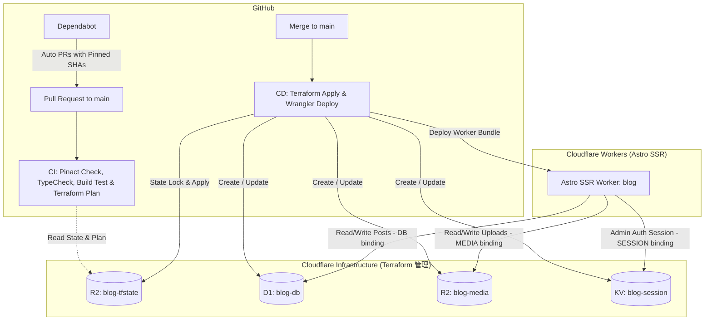

# Cloudflare CI/CD & Terraform インフラ設計仕様書

## 1. 概要
本仕様書は、EmDash ブログサイト（Cloudflare SSR 構成）の本番インフラを **Terraform** でコード管理（IaC）し、**GitHub Actions** を通じて PR 時の検証（`pinact` チェック・`terraform plan`・ビルドテスト）および `main` ブランチマージ時の自動デプロイ（`terraform apply` & `wrangler deploy`）を実現するための構成と運用手順を定めます。

また、サプライチェーン攻撃対策として **`pinact`** による GitHub Actions のコミットハッシュ完全ピン留めおよび **Dependabot** による自動更新設定を含みます。

---

## 2. アーキテクチャとリソース命名規則



### リソース命名とバインディング一覧
すべての Cloudflare リソースは `blog-` プレフィックスで統一し、ダッシュボード上で本ブログのリソースであることが一目で識別できるようにします。

| リソース種別 | Cloudflare リソース名 / タイトル | Astro / Worker 内バインディング名 | 用途 |
| :--- | :--- | :--- | :--- |
| **D1 データベース** | **`blog-db`** | `DB` | 記事データ・メタデータ保存 |
| **R2 メディアバケット** | **`blog-media`** | `MEDIA` | 画像・メディアアップロード保存 |
| **KV ネームスペース** | **`blog-session`** | `SESSION` | 管理画面ログインセッション保持 |
| **R2 tfstate バケット** | **`blog-tfstate`** | - | Terraform 状態管理 (S3 backend) |

---

## 3. Terraform 設計

### 3.1 ディレクトリ構成
```
terraform/
├── main.tf        # Provider 設定, S3 バックエンド (R2), D1 / R2 / KV リソース
├── variables.tf   # 変数定義 (account_id, project_name 等)
└── outputs.tf     # 出力定義 (d1_id, r2_name, kv_id)
```

### 3.2 Terraform バックエンド (Cloudflare R2)
Terraform の状態管理ファイル (`terraform.tfstate`) は、Cloudflare R2 の `blog-tfstate` バケットを用いて S3 互換 API 経由でリモート管理します。

```hcl
terraform {
  required_version = ">= 1.5.0"
  required_providers {
    cloudflare = {
      source  = "cloudflare/cloudflare"
      version = "~> 4.52.0"
    }
  }

  backend "s3" {
    bucket                      = "blog-tfstate"
    key                         = "terraform.tfstate"
    region                      = "auto"
    endpoint                    = "https://<CLOUDFLARE_ACCOUNT_ID>.r2.cloudflarestorage.com"
    skip_credentials_validation = true
    skip_region_validation      = true
    skip_requesting_account_id  = true
    skip_s3_checksum            = true
    skip_metadata_api_check     = true
  }
}
```

### 3.3 リソース定義
```hcl
provider "cloudflare" {
  # CLOUDFLARE_API_TOKEN 環境変数から自動読み込み
}

# D1 Database for EmDash Posts and Content
resource "cloudflare_d1_database" "blog" {
  account_id = var.cloudflare_account_id
  name       = "${var.project_name}-db"
}

# R2 Bucket for EmDash Uploaded Media and Images
resource "cloudflare_r2_bucket" "media" {
  account_id = var.cloudflare_account_id
  name       = "${var.project_name}-media"
  location   = "APAC"
}

# KV Namespace for Admin Auth and Sessions
resource "cloudflare_workers_kv_namespace" "session" {
  account_id = var.cloudflare_account_id
  title      = "${var.project_name}-session"
}
```

---

## 4. ツール管理 (`mise.toml`)

ローカル開発環境および GitHub Actions CI/CD で完全同一のツールチェーンを保証するため、[`mise.toml`](file:///Users/rikiyaota/Documents/github.com/RikiyaOta/blog/mise.toml) に `terraform` および `pinact` を追加します。

```toml
[settings]
minimum_release_age = "7d"

[tools]
node = "26"
pnpm = "11"
terraform = "1"
pinact = "4"
```

---

## 5. GitHub Actions ワークフロー & サプライチェーンセキュリティ設計

### 5.1 アクションの完全ハッシュピン留め (`pinact`)
ワークフロー内で参照されるサードパーティ製アクション（`actions/checkout`, `jdx/mise-action` など）は、すべて `pinact` を用いて Git コミットハッシュ形式で固定します。

例:
```yaml
- uses: actions/checkout@11bd71901bbe5b1630ceea73d27597364c9af683 # v4.2.2
- uses: jdx/mise-action@51ecda924ffea5481b4b574fae758a08d298f62f # v2.1.11
```

### 5.2 Dependabot 設定 (`.github/dependabot.yml`)
ピン留めされたコミットハッシュの更新を自動検知して PR を作成するよう Dependabot を設定します。

```yaml
version: 2
updates:
  - package-ecosystem: "github-actions"
    directory: "/"
    schedule:
      interval: "weekly"
```

### 5.3 PR 検証ワークフロー (`.github/workflows/ci.yml`)
- **トリガー**: `pull_request` (target: `main`)
- **ステップ**:
  1. `actions/checkout` (Pinned commit hash)
  2. `jdx/mise-action` (Pinned commit hash)
  3. `mise exec -- pinact run --verify` (アクションのハッシュピン留め漏れ検証)
  4. `pnpm install --frozen-lockfile`
  5. `pnpm exec tsc --noEmit` (型チェック)
  6. `env CLOUDFLARE=true pnpm build` (本番 SSR ビルドテスト)
  7. `terraform init` (R2 backend 接続検証)
  8. `terraform plan` (インフラ変更差分の検証)

### 5.4 本番デプロイワークフロー (`.github/workflows/deploy.yml`)
- **トリガー**: `push` (branches: `[main]`)
- **ステップ**:
  1. `actions/checkout` (Pinned commit hash)
  2. `jdx/mise-action` (Pinned commit hash)
  3. `pnpm install --frozen-lockfile`
  4. `terraform init` & `terraform apply -auto-approve` (インフラ自動反映)
  5. `env CLOUDFLARE=true pnpm build` (本番 Astro ビルド)
  6. `pnpm exec wrangler deploy` (Cloudflare Workers 本番デプロイ)

---

## 6. 必要な GitHub Secrets

| シークレット名 | 用途 |
| :--- | :--- |
| `CLOUDFLARE_API_TOKEN` | Cloudflare Terraform Provider & Wrangler デプロイ用 API トークン |
| `CLOUDFLARE_ACCOUNT_ID` | Cloudflare アカウント ID |
| `AWS_ACCESS_KEY_ID` | R2 S3 互換 API 用 Access Key ID（tfstate バックエンド用） |
| `AWS_SECRET_ACCESS_KEY` | R2 S3 互換 API 用 Secret Access Key（tfstate バックエンド用） |

---

## 7. 初期セットアップ手順（事前準備）
1. Cloudflare ダッシュボードの R2 にて、tfstate 保存用のバケット（`blog-tfstate`）を事前に作成。
2. Cloudflare ダッシュボードの R2 > "Manage R2 API Tokens" で S3 互換 API トークン（`AWS_ACCESS_KEY_ID`, `AWS_SECRET_ACCESS_KEY`）を発行。
3. GitHub Secrets に上記 4 つの環境変数を登録。
